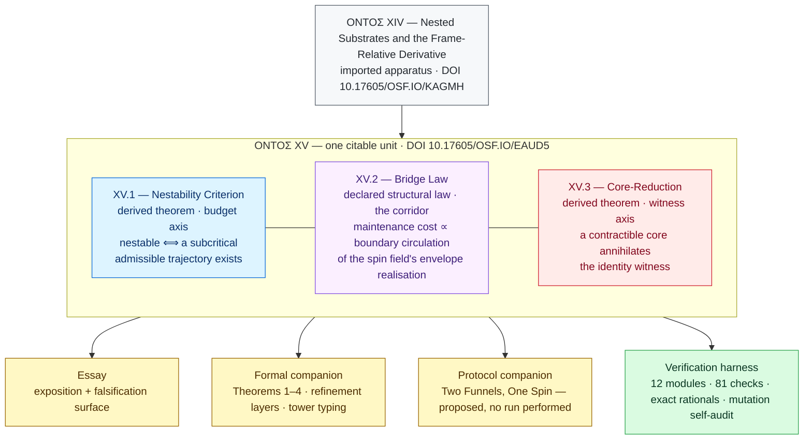

# NC2.5 — ONTOΣ XV: Spin-Channel and Nestability

**When can a substrate host a nested lower at all, what does holding it cost, and how does its identity die under transport?**

[](https://doi.org/10.17605/OSF.IO/EAUD5)
[](https://creativecommons.org/licenses/by-nc-nd/4.0/)
[](#verification-harness)
[](#verification-harness)
[](#verification-harness)
[](#verification-harness)
[](https://doi.org/10.17605/OSF.IO/NHTC5)

This repository contains ONTOΣ XV — an essay, its formal companion, and a table-top protocol companion — together with the executable verification harness, as one citable unit of the NC2.5 (Navigational Cybernetics 2.5) corpus. ONTOΣ XV is the immediate continuation of ONTOΣ XIV (bundle DOI 10.17605/OSF.IO/KAGMH): it answers the prior question of *nestability* (when a substrate admits any nested lower at all — answered in the formal IE-witness sense; see the status note below), constructs the *spin-channel bridge* between the imposed-spin field and the maintenance-of-nesting cost, and states *core-reduction* (a transport that lands the carrier in a contractible core annihilates the identity witness; factoring through one already blocks its carriage) as the transport-side reading of Regime W.

> **Status (read first).** This bundle is a *class-conditional formal programme with executable witnesses*. XV.1 (Nestability Criterion) and XV.3 (Core-Reduction) are derived theorems *only within their specified classes*: XV.1 is *formal IE-nestability* in finite-state $\mathsf{Sub}$ — the existence of a formally declared IE-witness lower substrate, **not** physical hostability, epistemic autonomy, or non-fabricated lower dynamics (the companion's autonomy ladder, Definition 2.5, grades those stronger claims); XV.3 is general topology applied to the imported carrier category. **XV.2 (the Bridge Law) is a declared structural law** of the boundary-layer-admissible class — a loop-bearing-envelope class (the envelope must carry a homologically non-trivial cycle; not every smooth boundary layer qualifies) — a sealed proportionality, not a derivation from lower axioms; its empirical content is the multi-event falsification discipline (companion Proposition 3.8) and, on the compatible subclass with integral witness data, the quantised cost-lattice test (companion Proposition 3.11). The walker-and-swarm pair is an **Illustration**, not a physical or deployment witness. The table-top protocol companion (*Two Funnels, One Spin*) is a **proposed protocol**: its physical instances are Illustration-level readings of classical fluid mechanics, none of its runs has been performed, and nothing physical is witnessed by it. The harness supplies **executable witnesses and consistency checks** — it is *not* a proof-assistant formalisation. No physically-confirmed cross-layer result is claimed.

**Author:** Maksim Barziankou (MxBv) — [LinkedIn](https://www.linkedin.com/in/maxbarzenkov)  
**Affiliation:** The Urgrund Laboratory  
**Website:** https://petronus.eu  
**License:** CC BY-NC-ND 4.0  
**Bundle DOI:** 10.17605/OSF.IO/EAUD5 (single deposit covering the essay + formal companion + table-top protocol companion + verification harness as one citable unit)  
**Axiomatic core anchor:** NC2.5 v2.1, DOI 10.17605/OSF.IO/NHTC5  
**Predecessor:** ONTOΣ XIV corpus bundle, DOI 10.17605/OSF.IO/KAGMH  
**Corpus:** one work in the 130+ work corpus of Navigational Cybernetics 2.5 (MxBv)  

## The three statements at a glance



| Statement | Register | One line |
|---|---|---|
| **XV.1** — Nestability Criterion | derived theorem, finite-state $\mathsf{Sub}$ | a substrate admits a nested lower — in the formal IE-witness sense — if and only if it carries a subcritical admissible trajectory; the *sealed core* is the canonical non-nestable witness |
| **XV.2** — Bridge Law | **declared structural law**, boundary-layer-admissible class | $M^{\mathrm{cost}} = c \cdot \lvert\sigma^{(M)}\rvert$ — a sealed proportionality, not a derivation; its empirical content is the multi-event falsification discipline and the quantised cost-lattice test |
| **XV.3** — Core-Reduction | derived theorem, $\mathsf{TopWit}$ | a transport factoring through a contractible core annihilates the identity witness — Regime W executed by transport under preservation conditions |

## Contents

| # | File | Role |
|---|---|---|
| 1 | `ONTOSigma-XV-Spin-Channel-and-Nestability.md` | main essay: XV.1 / XV.2 / XV.3 structural statements, two-axis symmetry, falsification surface |
| 2 | `Spin-Channel Bridge and Core-Reduction — A Categorical Foundation.md` | formal companion: Theorems 1–4, the boundary-witness-compatible subclass (Proposition 3.7), the multi-event and lattice falsifiers (Propositions 3.8 / 3.11), the transport kernel criterion and its calculus (Propositions 4.3–4.7), scope and open problems |
| 3 | `Two Funnels, One Spin — A Table-Top Protocol Companion.md` | table-top protocol companion: the two-glasses channel dichotomy (Illustration-level readings of classical fluid mechanics), the substrate-tariff reading of the constant $c$, the shape-monitor and the quasi-static W-death comparison, one engineering-register instance, and the proposed four-run protocol (Open Problems 7.2 / 7.6) — no run performed |
| — | `harness/` | executable verification harness (stdlib-only Python, deterministic; exact rational arithmetic except the two declared float demonstrators — see below) |

## Verify in one minute

```bash
git clone https://github.com/petronushowcore-mx/NC2.5-ONTOSigma-XV-Spin-Channel-and-Nestability-corpus.git
cd NC2.5-ONTOSigma-XV-Spin-Channel-and-Nestability-corpus
python harness/check_bundle.py
```

One command smoke-runs the whole battery in both interpreter modes, ties every declared check count to the code, and applies the packaging-hygiene gates. Green means: 81/81 checks across nine counted modules, the mutation self-audit behaving exactly as predicted, and the cross-document invariant gate clean. No dependencies, no build step — Python 3 standard library only.

## Recommended reading order

1. **Essay** — the exposition: the two doors XIV left open (nestability; the spin–cost corridor), the sealed core, core-reduction as Regime W executed by transport, and the falsification surface (§6).
2. **Companion** — the formal layer: proofs of Theorems 1, 3, 4 within their classes, the declared Bridge Law (Theorem 2) with its register notes, and the refinement layer (margin, autonomy ladder, quantisation floor, channel inequality, witness capacity, composition calculus).
3. **Protocol companion** — the physical layer, Illustration-register: the two-glasses channel dichotomy, the substrate-tariff reading of $c$, the shape-monitor and W-death comparison, the engineering-register instance, and the proposed four-run protocol; read after the essay.

## Verification harness

Every module runs standalone, prints its tally, and exits non-zero on any failure. The battery, from the repository root:

```bash
python harness/graph_hodge.py         # cohomology core: 15/15
python harness/nestability.py         # nestability margin + drift layer: 12/12
python harness/core_reduction.py      # transport kernel: 12/12
python harness/boundary_witness.py    # compatibility checks: 7/7
python harness/bridge_falsifier.py    # sealed-c + two-channel discipline: 13/13
python harness/tower_transport.py     # tower layer typing + fixtures: 7/7
python harness/pilot_entrainment.py   # synthetic demonstrator (OP 7.6): 7/7
python harness/funnel_channels.py     # table-top protocol discrete mirrors: 4/4
python harness/fano_channel.py        # source-localisation floor (Prop 5.4): 4/4
python harness/teeth_audit.py         # mutation self-audit: every mutation behaves as predicted (weakenings caught, documented survivors survive)
python harness/corpus_gate.py         # cross-document invariants over the corpus documents
python harness/check_bundle.py        # bundle gate: smoke both modes, count tie-out, packaging hygiene
```

Re-running any module under `python -O` must produce the same tally: the checks are raise-based, not assert-based, so optimisation does not vacate them (`check_bundle.py` exercises both modes for the whole battery).

**What the harness covers.** Finite graph-Hodge computation over exact rationals (cycle space, periods, induced maps on homology and cohomology, rank and bottleneck bounds, harmonic representatives via the weighted graph Laplacian, and the minimal-entrainment floors with their attainment profiles); the nestability criterion and margin by direct enumeration, with the sealed core as negative control, and the drift layer's forced Independent-Exhaustion (declared window bands force the crossing within the derived horizon at bounded image burden; band violations and the N·ε ≥ 1 boundary are exercised, the latter as an honest withholding); transport-kernel classification (preserving / annihilating / partial) on finite carriers, including the degree-zero non-contractible instance and the composition counterexample; the boundary-witness compatibility hypotheses (H-a / H-b) on declared graph data, with rejection of degree-m, collapsed, and merely-pointwise declarations; and the multi-event sealed-constant falsification discipline of the Bridge Law, including the zero-spin control, the quantised lattice test (implemented in its full-power regime $\varepsilon < c/2$; the companion's floor-only wider-tolerance clause is stated mathematically, not exposed as a separate helper), the derived-floor sanity gate, and the two-channel feasibility falsifier (exact two-variable elimination with a self-verifying witness). The tower layer (`tower_transport.py`) exercises the inter-level typing on finite towers: the derived lower restriction with its rejection cases, all four combinations of per-level witness verdicts realised by single transports, the pinch criterion, summed floors, and the period ladder in both its honest layers (parallel per-pair equalities; composition only under a declared witness-alignment). A mutation self-audit (`teeth_audit.py`) deliberately weakens each verified property and requires the corresponding check to fail, so the battery is non-vacuous. A synthetic continuous demonstrator (`pilot_entrainment.py` — floats with declared tolerances, deliberately outside the exact-rational battery) exercises the measurement pipeline end to end: field-side circulation and norm readings and dynamics-side maintenance come from independent code paths, the derived floor gates the measured readings, and the sealed-constant discipline passes its disjoint holdout (disjointness enforced by the fixture; in a deployment it is a protocol obligation, not machine-checked) and catches corrupted data; it validates instruments and discipline in a controlled world and does not confirm the Bridge Law for any physical system. The protocol companion's discrete mirrors (`funnel_channels.py`) verify the annulus two-channel dichotomy over declared quad 2-cells (ring periods differing for the non-closed cochain; equal and non-zero for the closed one, with the discrete Stokes consistency identity), the substrate-tariff discipline (per-substrate sealed constant with holdout, wrongly-pooled-class rejection, the regime-dependent-constant falsifier), and the W-death carrier comparison (H¹-trivial post-carrier, a declared collapse stand-in, the magnitude reading alive) — the protocol document's depth laws are document-level derivations of classical results, deliberately not machine-verified. The source-localisation floor (`fano_channel.py` — the estimator side exact-rational, the entropy side in floats against a sealed tolerance) checks the floor of companion Proposition 5.4 against the exact best-estimator error across declared finite channels, with the degradation bite and rejection controls; the channel matrix is a declared sealed datum, and the module enforces the floor's arithmetic, not the declaration's fidelity.

**What the harness does not cover.** Continuous de Rham machinery and smooth-manifold carriers; physical boundary-layer measurement; calibration of the Bridge constant $c$ (Open Problem 7.2); non-smooth envelopes (Open Problem 7.3); the depth-$n$ residue of Open Problem 7.4 (composite cohomology stack, cross-level rank bound; bidirectional towers per Open Problem 7.5). The physical runs of the protocol companion's §8 are proposed, not performed. The harness *enforces the declared structural relations and supplies the falsifiers of essay §6*; it does **not** prove XV.2, which is a declared structural law.

**Layout.** The harness resolves the corpus documents relative to this repository layout (the corpus `.md` files at the root, the scripts inside `harness/`). Run it from an intact clone; a flattened copy of the files will be rejected with an explanatory message rather than a traceback.

## How to cite

> Barziankou, M. (2026). *ONTOΣ XV — Spin-Channel and Nestability* (essay, formal companion, table-top protocol companion, and verification harness). NC2.5 corpus bundle, The Urgrund Laboratory. DOI: [10.17605/OSF.IO/EAUD5](https://doi.org/10.17605/OSF.IO/EAUD5)

```bibtex
@misc{barziankou2026ontosxv,
  author = {Barziankou, Maksim},
  title  = {ONTOS XV --- Spin-Channel and Nestability: essay, formal companion,
            table-top protocol companion, and verification harness},
  year   = {2026},
  doi    = {10.17605/OSF.IO/EAUD5},
  note   = {NC2.5 corpus bundle. The Urgrund Laboratory. License CC BY-NC-ND 4.0.}
}
```

## Corpus references

DOIs for the predecessor works this bundle imports from are listed in the companion, §8 (References): NC2.5 v2.1 core, the ONTOΣ XIV bundle, Operational Spin, the X+M ledger discipline, the admissibility foundation, and the schema papers.
